# Exchange Calendar Event Management Automation

## Overview

This solution provides automated calendar event creation and management using Azure Automation, PowerShell, and Microsoft Graph API. It reads event data from Excel files stored in SharePoint and creates calendar events for individual users and groups, with comprehensive logging and monitoring capabilities.

## 📋 Table of Contents

- [Features](#features)
- [Architecture](#architecture)
- [Prerequisites](#prerequisites)
- [Quick Deploy](#quick-deploy)
- [Automated Configuration Scripts](#automated-configuration-scripts)
- [Manual Setup Instructions](#manual-setup-instructions)
  - [Azure Automation Account Setup](#azure-automation-account-setup)
  - [Storage Account Configuration](#storage-account-configuration)
  - [Web Dashboard Deployment](#web-dashboard-deployment)
- [Usage Guide](#usage-guide)
- [Monitoring and Logging](#monitoring-and-logging)
- [Troubleshooting](#troubleshooting)
- [File Structure](#file-structure)

## ✨ Features

- **Automated Calendar Event Creation**: Creates calendar events for individual users and groups
- **SharePoint Integration**: Reads event data from Excel files stored in SharePoint
- **Smart Group Handling**: Automatically resolves distribution groups and M365 groups to individual members
- **Intelligent Caching**: Optimizes performance with address caching to prevent redundant API calls
- **Comprehensive Logging**: Detailed logging with Azure Storage integration for monitoring
- **Web Dashboard**: Real-time monitoring dashboard with log analysis capabilities
- **Error Handling**: Robust retry logic and error classification for better reliability
- **Duplicate Prevention**: Checks for existing events to prevent duplicates

## 🏗️ Architecture

```mermaid
graph TB
    %% Central Orchestrator
    AA[🤖 Azure Automation Account] --> PSR[⚙️ PowerShell Runbook]
    
    %% PowerShell Runbook Operations
    PSR --> SP[📊 SharePoint Excel Files]
    PSR --> MG[🔗 Microsoft Graph API]
    PSR --> EO[📧 Exchange Online]
    PSR --> AS[☁️ Azure Storage]
    
    %% SharePoint Bi-directional Flow
    SP -.->|Excel Data| PSR
    PSR -.->|Updates| SP
    
    %% API Interactions
    PSR -.->|Events| MG
    PSR -.->|Groups| EO
    
    %% Log Storage Flow
    PSR -.->|Logs| AS
    AS --> LOGS[📝 Log Files]
    
    %% Web Dashboard Access
    AS --> WD[🌐 Web Dashboard]
    AS --> LA[📋 Log Analyzer]
    WD -.-> LOGS
    LA -.-> LOGS
    
    %% User Interactions
    USER[👤 User] --> WD
    USER --> LA
    
    %% Styling
    classDef azure fill:#0078d4,stroke:#106ebe,stroke-width:2px,color:#fff
    classDef microsoft fill:#00bcf2,stroke:#0078d4,stroke-width:2px,color:#fff
    classDef automation fill:#28a745,stroke:#1e7e34,stroke-width:2px,color:#fff
    classDef web fill:#17a2b8,stroke:#138496,stroke-width:2px,color:#fff
    classDef data fill:#6c757d,stroke:#495057,stroke-width:2px,color:#fff
    classDef user fill:#ffc107,stroke:#e0a800,stroke-width:2px,color:#000
    
    class AS,AA azure
    class MG,EO,SP microsoft
    class PSR automation
    class WD,LA web
    class LOGS data
    class USER user
```



## 📋 Prerequisites

- Azure subscription with appropriate permissions
- Microsoft 365 tenant with Exchange Online
- SharePoint site for storing Excel files
- Azure Automation Account
- Azure Storage Account
- App Registration with required API permissions

## 🚀 Quick Deploy

Deploy the required Azure resources with one click:

### Deploy Storage Account

[](https://portal.azure.com/#create/Microsoft.Template/uri/https%3A%2F%2Fraw.githubusercontent.com%2Fofirga%2FExchange-Calendar-Event-Management-Automation%2Fmain%2Fdeploy%2Fstorage-template.json)

This deploys:
- Azure Storage Account with static website hosting
- CORS configuration for web dashboard access
- `$web` container for hosting the dashboard files

### Deploy Automation Account

[](https://portal.azure.com/#create/Microsoft.Template/uri/https%3A%2F%2Fraw.githubusercontent.com%2Fofirga%2FExchange-Calendar-Event-Management-Automation%2Fmain%2Fdeploy%2Fautomation-template.json)

This deploys:
- Azure Automation Account with managed identity
- All required configuration variables
- Ready for PowerShell module installation

> ⚠️ **Note**: After deployment, you still need to:
> 1. Install PowerShell modules in the Automation Account
> 2. Create and configure App Registration
> 3. Upload certificates and runbook script
> 4. Configure API permissions and Sites.Selected permissions

📖 **[Complete Deployment Guide](deploy/DEPLOYMENT-GUIDE.md)** - Detailed deployment instructions, parameters, and troubleshooting

## 🤖 Automated Configuration Scripts

**NEW!** Automate the remaining setup steps with PowerShell scripts:

### 🚀 Quick Setup (3 Scripts)

```powershell
# 1. Create App Registration & Certificates
.\scripts\1-Setup-AppRegistration.ps1 -AutomationAccountName "your-aa-name" -AutomationResourceGroupName "your-rg-name"

# 2. Configure API Permissions  
.\scripts\2-Configure-Permissions.ps1

# 3. Configure SharePoint Permissions
.\scripts\3-Configure-SharePoint-Permissions.ps1 -SharePointSiteUrl "https://your-tenant.sharepoint.com/sites/events"
```

### What Gets Automated:
✅ **App Registration Creation** - Azure AD app with proper settings  
✅ **Certificate Generation** - Self-signed certificates for authentication  
✅ **Certificate Upload** - To both App Registration and Automation Account  
✅ **API Permissions** - Microsoft Graph and Exchange Online permissions  
✅ **Sites.Selected** - SharePoint site-specific permissions  
✅ **Admin Consent** - Guided admin consent process  

### Prerequisites:
- PowerShell 5.1+
- Global Administrator or Application Administrator role
- Contributor access to Automation Account

📖 **[Automation Scripts Guide](scripts/INSTALLATION-GUIDE.md)** - Complete setup automation documentation

## 🔧 Manual Setup Instructions

If you prefer manual setup or need to complete the remaining configuration steps:

### Azure Automation Account Setup

#### 1. Create Azure Automation Account

1. **Create the Automation Account**:
   - Navigate to Azure Portal → **Create a resource** → **Automation**
   - **Resource Group**: Create new or use existing
   - **Name**: Choose a descriptive name (e.g., `calendar-event-automation`)
   - **Region**: Select your preferred region
   - **Create Azure Run As account**: **Yes** (for managed identity)

2. **Enable Managed Identity**:
   - Go to your Automation Account → **Settings** → **Identity**
   - Set **System assigned** status to **On**
   - **Save** and note the **Object ID** for later use

#### 2. Install Required PowerShell Modules

Navigate to **Automation Account** → **Shared Resources** → **Modules** → **Browse Gallery**

Install these modules **in order** (wait for each to complete before installing the next):

1. **Microsoft.Graph.Authentication** (Required first)
   - Search for "Microsoft.Graph.Authentication"
   - Click **Import** → **OK**
   - Wait for status to show "Available"

2. **Microsoft.Graph** (Main Graph module)
   - Search for "Microsoft.Graph"
   - Click **Import** → **OK**
   - **This takes 15-30 minutes** - be patient!

3. **ImportExcel** (Excel file processing)
   - Search for "ImportExcel"
   - Click **Import** → **OK"

4. **ExchangeOnlineManagement** (Exchange Online groups)
   - Search for "ExchangeOnlineManagement"
   - Click **Import** → **OK**

5. **Az.Storage** (Azure Storage logging)
   - Search for "Az.Storage"
   - Click **Import** → **OK**

6. **Az.Accounts** (Azure authentication)
   - Search for "Az.Accounts"  
   - Click **Import** → **OK"

> ⚠️ **Important**: Install modules in the exact order shown above. The Microsoft.Graph module is particularly large and can take 15-30 minutes to install.

#### 3. Create App Registration and Certificates

**Option A: Use Automation Scripts (Recommended)**
```powershell
.\scripts\1-Setup-AppRegistration.ps1 -AutomationAccountName "your-aa-name" -AutomationResourceGroupName "your-rg-name"
```

**Option B: Manual Process**

1. **Create App Registration in Azure AD**:
   - Go to **Azure Active Directory** → **App registrations** → **New registration**
   - **Name**: `Calendar-Event-Automation`
   - **Supported account types**: Accounts in this organizational directory only
   - **Redirect URI**: Leave blank
   - Click **Register**

2. **Generate Client Certificate**:
   ```powershell
   # Create self-signed certificate
   $cert = New-SelfSignedCertificate -Subject "CN=Calendar-Event-Automation" `
     -CertStoreLocation "Cert:\CurrentUser\My" -KeySpec KeyExchange
   
   # Export certificate for upload
   Export-Certificate -Cert $cert -FilePath ".\CalendarAutomation.cer"
   ```

3. **Upload Certificate to App Registration**:
   - Go to **Certificates & secrets** → **Certificates** → **Upload certificate**
   - Select the `.cer` file created above
   - Click **Add**

📖 **[Complete Manual Setup Guide](docs/MANUAL-SETUP.md)** - Detailed step-by-step instructions

### Storage Account Configuration

> **💡 Quick Deploy**: Use the [Deploy to Azure button](#deploy-storage-account) above for automated setup with optimal configuration.

#### 1. Create Azure Storage Account (Manual)

1. Create a new Storage Account in Azure Portal
2. Choose **Standard** performance tier
3. Select **StorageV2 (general purpose v2)** account kind
4. Enable **Static website** hosting

#### 2. Configure Static Website

1. Navigate to your Storage Account
2. Go to **Settings** > **Static website**
3. Enable static website hosting
4. Set **Index document name**: `index.html`
5. Set **Error document path**: `index.html`
6. Note the **Primary endpoint** URL (e.g., `https://yourstorageaccount.z6.web.core.windows.net/`)

#### 3. Enable CORS (Cross-Origin Resource Sharing)

To allow the web dashboard to access log files in the `logs` folder:

1. Go to **Settings** > **Resource sharing (CORS)**
2. Add a new CORS rule for **Blob service**:
   - **Allowed origins**: `*` (or specify your static website URL)
   - **Allowed methods**: `GET, HEAD, OPTIONS`
   - **Allowed headers**: `*`
   - **Exposed headers**: `*`
   - **Max age**: `3600`

3. Click **Save**

#### 4. Create the `logs` folder

1. Go to **Data storage** > **Containers**
2. Select the **$web** container
3. Create a new folder called `logs`

> **📁 Expected folder structure in `$web` container:**
```
$web/
├── index.html
├── log-analyzer.html
└── logs/
    └── (log files will be created here by the automation script)
```

### Web Dashboard Deployment

#### 1. Upload Web Files to Storage Account

1. **Upload `index.html`** to the root of the `$web` container
2. **Upload `log-analyzer.html`** to the root of the `$web` container

**Using Azure Storage Explorer:**
1. Download and install [Azure Storage Explorer](https://azure.microsoft.com/features/storage-explorer/)
2. Connect to your storage account
3. Navigate to the `$web` container
4. Upload both HTML files to the root of the container

**Using Azure Portal:**
1. Go to your Storage Account → **Data storage** → **Containers** → **$web**
2. Click **Upload** → Select files → Upload both HTML files

#### 2. Configure Azure Automation for Log Storage

Update the PowerShell script variables to match your storage account:

```powershell
$StorageAccountName = "yourstorageaccount"  # Replace with your actual storage account name
```

The script will automatically create log files in the `$web/logs/` directory, accessible via:
- `https://yourstorageaccount.z6.web.core.windows.net/logs/`

## 📖 Usage Guide

### Using the Main Dashboard (index.html)

1. **Access the dashboard** via your Storage Account's static website URL
2. **Monitor automation runs** in real-time
3. **View logs** directly in the browser
4. **Analyze performance** with built-in metrics
5. **Dark/Light mode** toggle for better visibility

**Key features:**
- Real-time log streaming
- Event processing statistics
- Error highlighting and filtering
- Performance metrics dashboard

### Using the Log Analyzer (log-analyzer.html)

1. **Advanced log analysis** with intelligent issue detection
2. **Pattern recognition** for common errors
3. **Performance trend analysis**
4. **Export capabilities** for detailed reporting

**Advanced features:**
- AI-powered issue detection
- Historical trend analysis
- Custom log filtering
- Performance bottleneck identification

### Running the Automation

1. **Upload your Excel file** to the configured SharePoint library
2. **Trigger the runbook** in Azure Automation (manual or scheduled)
3. **Monitor progress** via the web dashboard
4. **Review results** in the log analyzer

## 📊 Monitoring and Logging

### Log Storage

All logs are stored in your Azure Storage Account under the `$web/logs/` path:
- **Structured JSON logs** for programmatic access
- **Human-readable format** for manual review
- **Automatic retention** based on your storage account settings

### Log Levels

- **INFO**: General operation information
- **WARNING**: Non-critical issues that don't stop execution
- **ERROR**: Critical errors that prevent processing
- **DEBUG**: Detailed diagnostic information

### Monitoring Tools

1. **Web Dashboard** (`index.html`):
   - Real-time log monitoring
   - Performance metrics
   - Event processing status

2. **Log Analyzer** (`log-analyzer.html`):
   - Advanced log analysis
   - Issue pattern detection
   - Historical trends

3. **Azure Monitor Integration**:
   - Automation Account job status
   - Resource utilization metrics
   - Alert configuration

## 🔧 Troubleshooting

### Common Issues

#### 1. Log Files Not Appearing in Dashboard

**Problem**: Dashboard shows "No logs found" or logs don't update

**Solution**:
1. Verify the **Storage Account name** in the PowerShell script matches your actual storage account
2. Check that the **Managed Identity** has `Storage Blob Data Contributor` permissions
3. Ensure the `$web/logs/` folder exists in your storage account
4. Verify **CORS settings** allow access from your dashboard URL

#### 2. "Insufficient privileges to complete the operation"

**Problem**: Script fails with Graph API permission errors

**Solution**:
1. Verify all **API permissions** are properly configured:
   - `Calendars.ReadWrite`
   - `User.Read.All`
   - `Group.Read.All`
   - `Sites.Selected`
2. Ensure **Admin consent** has been granted for all permissions
3. Check that **Sites.Selected** permission is properly configured for your SharePoint site

#### 3. Excel File Access Issues

**Problem**: "Access denied" when reading Excel files from SharePoint

**Solution**:
1. Verify **Sites.Selected** permission is configured for the correct SharePoint site
2. Check that the **SharePoint site URL** and **library path** are correctly specified
3. Ensure the **Excel file** exists in the specified location
4. Verify the **App Registration** has been granted access to the specific site

#### 4. Exchange Online Group Resolution Fails

**Problem**: Distribution groups aren't being resolved to individual members

**Solution**:
1. Verify **Exchange.ManageAsApp** permission is granted
2. Check that the **Application Access Policy** is properly configured
3. Ensure your **tenant admin** has approved the Exchange Online permissions
4. Test with a simple distribution group first

#### 5. Automation Account Module Issues

**Problem**: Modules fail to import or show as "Failed" status

**Solution**:
1. **Retry module installation** - temporary Azure issues are common
2. Install modules **one at a time** in the specified order
3. Wait for each module to show **"Available"** before installing the next
4. Clear browser cache and refresh the Modules page
5. For persistent issues, try installing a slightly older version of the module

### Performance Optimization

#### Slow Event Processing

1. **Enable address caching** in the script (default: enabled)
2. **Reduce Excel file size** by processing in smaller batches
3. **Monitor API throttling** and implement appropriate delays
4. **Use selective imports** for large distribution groups

#### High Memory Usage

1. **Process Excel files in chunks** rather than loading all data at once
2. **Clear variables** after processing large datasets
3. **Monitor runbook execution time** and split into smaller operations if needed

### Log Analysis Insights

The Log Analyzer provides intelligent insights for common issues:

- **Permission Problems**: Detects and suggests fixes for API permission issues
- **Performance Bottlenecks**: Identifies slow operations and suggests optimizations
- **Data Quality Issues**: Flags problematic Excel data formats
- **Network Issues**: Detects and correlates network-related failures

## 📁 File Structure

```
Exchange-Calendar-Event-Management-Automation/
├── eventscalendarautomation.ps1      # Main PowerShell automation script
├── index.html                        # Main web dashboard
├── log-analyzer.html                 # Advanced log analysis tool
├── README.md                         # This documentation
├── deploy/                           # Azure ARM deployment templates
│   ├── storage-template.json         # Storage Account ARM template
│   ├── automation-template.json      # Automation Account ARM template
│   └── DEPLOYMENT-GUIDE.md           # Detailed deployment guide
├── scripts/                          # PowerShell automation scripts
│   ├── 1-Setup-AppRegistration.ps1   # App Registration setup
│   ├── 2-Configure-Permissions.ps1   # API permissions configuration
│   ├── 3-Configure-SharePoint-Permissions.ps1  # SharePoint permissions
│   ├── INSTALLATION-GUIDE.md         # Scripts installation guide
│   └── README.md                     # Scripts documentation
└── docs/                            # Additional documentation
    └── MANUAL-SETUP.md               # Complete manual setup guide
```

## 🤝 Contributing

1. Fork the repository
2. Create a feature branch (`git checkout -b feature/AmazingFeature`)
3. Commit your changes (`git commit -m 'Add some AmazingFeature'`)
4. Push to the branch (`git push origin feature/AmazingFeature`)
5. Open a Pull Request

## 📄 License

This project is licensed under the MIT License - see the [LICENSE](LICENSE) file for details.

---

**Made with ❤️ for automated calendar management**