# Exchange Calendar Event Management Automation

## Overview

This solution provides automated calendar event> ⚠️ **Note*> 4. Configure API permissions and Sites.Selected permissions

## 🤖 Automated Configuration Scripts

**NEW!** Automate the remaining setup steps with PowerShell scripts:

### 🚀 Quick Setup (3 Scripts)

```powershell
# 1. Create App Registration & Certificates
.\scripts\1-Setup-AppRegistration.ps1 -AutomationAccountName "your-aa-name" -AutomationResourceGroupName "your-rg-name"

# 2. Configure API Permissions  
.\scripts\2-Configure-Permissions.ps1

# 3. Configure SharePoint Permissions
.\scripts\3-Configure-SharePoint-Permissions.ps1 -SharePointSiteUrl "https://your-tenant.sharepoint.com/sites/events"
```

### What Gets Automated:
✅ **App Registration Creation** - Azure AD app with proper settings  
✅ **Certificate Generation** - Self-signed certificates for authentication  
✅ **Certificate Upload** - To both App Registration and Automation Account  
✅ **API Permissions** - Microsoft Graph and Exchange Online permissions  
✅ **Sites.Selected** - SharePoint site-specific permissions  
✅ **Admin Consent** - Guided admin consent process  

### Prerequisites:
- PowerShell 5.1+
- Global Administrator or Application Administrator role
- Contributor access to Automation Account

📖 **[Automation Scripts Guide](scripts/INSTALLATION-GUIDE.md)** - Complete setup automation documentation

## 🔧 Manual Setup Instructions

If you prefer manual setup or need to complete the remaining configuration steps:ter deployment, you still need to:
> 1. Install PowerShell modules in the Automation Account
> 2. Create and configure App Registration
> 3. Upload certificates and runbook script
> 4. Configure API permissions and Sites.Selected permissions

📖 **[Complete Deployment Guide](deploy/DEPLOYMENT-GUIDE.md)** - Detailed deployment instructions, parameters, and troubleshooting

## 🔧 Manual Setup Instructionson and management using Azure Automation, PowerShell, and Microsoft Graph API. It reads event data from Excel files stored in SharePoint and creates calendar events for individual users and groups, with comprehensive logging and monitoring capabilities.

## 📋 Table of Contents

- [Features](#features)
- [Architecture](#architecture)
- [Prerequisites](#prerequisites)
- [Setup Instructions](#setup-instructions)
  - [Azure Automation Account Setup](#azure-automation-account-setup)
  - [Storage Account Configuration](#storage-account-configuration)
  - [Web Dashboard Deployment](#web-dashboard-deployment)
- [Usage Guide](#usage-guide)
- [Monitoring and Logging](#monitoring-and-logging)
- [Troubleshooting](#troubleshooting)
- [File Structure](#file-structure)

## ✨ Features

- **Automated Calendar Event Creation**: Creates calendar events for individual users and groups
- **SharePoint Integration**: Reads event data from Excel files stored in SharePoint
- **Smart Group Handling**: Automatically resolves distribution groups and M365 groups to individual members
- **Intelligent Caching**: Optimizes performance with address caching to prevent redundant API calls
- **Comprehensive Logging**: Detailed logging with Azure Storage integration for monitoring
- **Web Dashboard**: Real-time monitoring dashboard with log analysis capabilities
- **Error Handling**: Robust retry logic and error classification for better reliability
- **Duplicate Prevention**: Checks for existing events to prevent duplicates

## 🏗️ Architecture

```mermaid
graph TB
    %% Central Orchestrator
    AA[🤖 Azure Automation Account] --> PSR[⚙️ PowerShell Runbook]
    
    %% PowerShell Runbook Operations
    PSR --> SP[📊 SharePoint Excel Files]
    PSR --> MG[🔗 Microsoft Graph API]
    PSR --> EO[📧 Exchange Online]
    PSR --> AS[☁️ Azure Storage]
    
    %% SharePoint Bi-directional Flow
    SP -.->|Excel Data| PSR
    PSR -.->|Updates| SP
    
    %% API Interactions
    PSR -.->|Events| MG
    PSR -.->|Groups| EO
    
    %% Log Storage Flow
    PSR -.->|Logs| AS
    AS --> LOGS[📝 Log Files]
    
    %% Web Dashboard Access
    AS --> WD[🌐 Web Dashboard]
    AS --> LA[📋 Log Analyzer]
    WD -.-> LOGS
    LA -.-> LOGS
    
    %% User Interactions
    USER[👤 User] --> WD
    USER --> LA
    
    %% Styling
    classDef azure fill:#0078d4,stroke:#106ebe,stroke-width:2px,color:#fff
    classDef microsoft fill:#00bcf2,stroke:#0078d4,stroke-width:2px,color:#fff
    classDef automation fill:#28a745,stroke:#1e7e34,stroke-width:2px,color:#fff
    classDef web fill:#17a2b8,stroke:#138496,stroke-width:2px,color:#fff
    classDef data fill:#6c757d,stroke:#495057,stroke-width:2px,color:#fff
    classDef user fill:#ffc107,stroke:#e0a800,stroke-width:2px,color:#000
    
    class AS,AA azure
    class MG,EO,SP microsoft
    class PSR automation
    class WD,LA web
    class LOGS data
    class USER user
```



## 📋 Prerequisites

- Azure subscription with appropriate permissions
- Microsoft 365 tenant with Exchange Online
- SharePoint site for storing Excel files
- Azure Automation Account
- Azure Storage Account
- App Registration with required API permissions

## � Quick Deploy

Deploy the required Azure resources with one click:

### Deploy Storage Account

[](https://portal.azure.com/#create/Microsoft.Template/uri/https%3A%2F%2Fraw.githubusercontent.com%2Fofirga%2FExchange-Calendar-Event-Management-Automation%2Fmain%2Fdeploy%2Fstorage-template.json)

This deploys:
- Azure Storage Account with static website hosting
- CORS configuration for web dashboard access
- `$web` container for hosting the dashboard files

### Deploy Automation Account

[](https://portal.azure.com/#create/Microsoft.Template/uri/https%3A%2F%2Fraw.githubusercontent.com%2Fofirga%2FExchange-Calendar-Event-Management-Automation%2Fmain%2Fdeploy%2Fautomation-template.json)

This deploys:
- Azure Automation Account with managed identity
- All required configuration variables
- Ready for PowerShell module installation

> ⚠️ **Note**: After deployment, you still need to:
> 1. Install PowerShell modules in the Automation Account
> 2. Create and configure App Registration
> 3. Upload certificates and runbook script
> 4. Configure API permissions and Sites.Selected permissions

## �🔧 Manual Setup Instructions

If you prefer manual setup or need to complete the remaining configuration steps:

### Azure Automation Account Setup

#### 1. Create Azure Automation Account

1. **Create the Automation Account**:
   - Navigate to Azure Portal → **Create a resource** → **Automation**
   - **Resource Group**: Create new or use existing
   - **Name**: Choose a descriptive name (e.g., `calendar-event-automation`)
   - **Region**: Select your preferred region
   - **Create Azure Run As account**: **Yes** (for managed identity)

2. **Enable Managed Identity**:
   - Go to your Automation Account → **Settings** → **Identity**
   - Set **System assigned** status to **On**
   - **Save** and note the **Object ID** for later use

#### 2. Install Required PowerShell Modules

Navigate to **Automation Account** → **Shared Resources** → **Modules** → **Browse Gallery**

Install these modules **in order** (wait for each to complete before installing the next):

1. **Microsoft.Graph.Authentication** (Required first)
   - Search for "Microsoft.Graph.Authentication"
   - Click **Import** → **OK**
   - Wait for status to show "Available"

2. **Microsoft.Graph** (Main Graph module)
   - Search for "Microsoft.Graph"
   - Click **Import** → **OK**
   - **This takes 15-30 minutes** - be patient!

3. **ImportExcel**
   - Search for "ImportExcel"
   - Click **Import** → **OK**

4. **ExchangeOnlineManagement**
   - Search for "ExchangeOnlineManagement"
   - Click **Import** → **OK**

5. **Az.Storage** (for blob logging)
   - Search for "Az.Storage"
   - Click **Import** → **OK**

6. **Az.Accounts** (for managed identity authentication)
   - Search for "Az.Accounts"  
   - Click **Import** → **OK**

> **⚠️ Important**: Module installation can take 30-60 minutes total. Monitor the **Import Status** and ensure each module shows "Available" before proceeding.

#### 3. Create App Registration for Authentication

1. **Create App Registration**:
   - Go to **Azure Active Directory** → **App registrations** → **New registration**
   - **Name**: `Calendar-Event-Automation`
   - **Supported account types**: Accounts in this organizational directory only
   - **Redirect URI**: Leave blank
   - Click **Register**

2. **Note the Application Details**:
   - **Application (client) ID**: Copy this value
   - **Directory (tenant) ID**: Copy this value

3. **Create and Upload Certificate**:
   ```powershell
   # Run this PowerShell to create a self-signed certificate
   $cert = New-SelfSignedCertificate -CertStoreLocation "Cert:\CurrentUser\My" `
     -Subject "CN=CalendarAutomation" -KeySpec KeyExchange -FriendlyName "CalendarAutomation"
   
   # Export certificate
   $password = ConvertTo-SecureString -String "YourStrongPassword" -Force -AsPlainText
   Export-PfxCertificate -Cert $cert -FilePath "C:\temp\CalendarAutomation.pfx" -Password $password
   
   # Export public key for App Registration
   Export-Certificate -Cert $cert -FilePath "C:\temp\CalendarAutomation.cer"
   ```

4. **Upload Certificate to App Registration**:
   - In your App Registration → **Certificates & secrets** → **Certificates**
   - Click **Upload certificate** → Select the `.cer` file
   - **Description**: "Calendar Automation Certificate"
   - Click **Add**

5. **Upload Certificate to Automation Account**:
   - Go to **Automation Account** → **Shared Resources** → **Certificates**
   - Click **+ Add a certificate**
   - **Name**: `CalendarAutomationCert` (exact name used in script)
   - **Upload a certificate file**: Select the `.pfx` file
   - **Password**: Enter the password you used
   - **Exportable**: No
   - Click **Create**

#### 4. Configure API Permissions

In your **App Registration** → **API permissions**:

1. **Microsoft Graph Permissions** (Application permissions):
   - `Calendars.ReadWrite` - Create and manage calendar events
   - `Directory.Read.All` - Read directory data
   - `User.Read.All` - Read all users' profiles
   - `Group.Read.All` - Read all groups
   - `Files.Read` - **CRITICAL** for SharePoint file access
   - `Sites.Selected` - **CRITICAL** for specific SharePoint site access

2. **Exchange Online Permissions**:
   - `Exchange.ManageAsApp` - Manage Exchange as application

3. **Grant Admin Consent**:
   - Click **Grant admin consent for [Your Organization]**
   - Click **Yes** to confirm

#### 5. Configure Sites.Selected Permissions for SharePoint

> **🔑 This is CRITICAL** for the script to update Excel files back to SharePoint with `DateOfLastRun`

**Option A: Using PowerShell PnP (Recommended)**

```powershell
# Install PnP PowerShell if not already installed
Install-Module -Name PnP.PowerShell -Force

# Connect to your tenant (replace with your admin URL)
Connect-PnPOnline -Url "https://yourtenant-admin.sharepoint.com" -Interactive

# Grant Sites.Selected permission to your specific site
# Replace with your App ID and Site URL
Grant-PnPAzureADAppSitePermission -AppId "YOUR-APP-CLIENT-ID" `
  -DisplayName "Calendar Event Automation" `
  -Site "https://yourtenant.sharepoint.com/sites/yoursite" `
  -Permissions Write
```

**Option B: Using Graph API**

```powershell
# First, get your site ID
$siteUrl = "https://yourtenant.sharepoint.com/sites/yoursite"
$siteId = Invoke-RestMethod -Uri "https://graph.microsoft.com/v1.0/sites/$($siteUrl.Replace('https://','').Replace('/',':'))" -Headers @{Authorization="Bearer $accessToken"}

# Grant permission
$body = @{
    roles = @("write")
    grantedToIdentities = @(
        @{
            application = @{
                id = "YOUR-APP-CLIENT-ID"
                displayName = "Calendar Event Automation"
            }
        }
    )
} | ConvertTo-Json -Depth 4

Invoke-RestMethod -Uri "https://graph.microsoft.com/v1.0/sites/$($siteId.id)/permissions" `
  -Method POST -Body $body -ContentType "application/json" `
  -Headers @{Authorization="Bearer $accessToken"}
```

#### 6. Configure Exchange Online Permissions

1. **Connect to Exchange Online PowerShell**:
   ```powershell
   Install-Module -Name ExchangeOnlineManagement -Force
   Connect-ExchangeOnline
   ```

2. **Create Application Access Policy**:
   ```powershell
   # Replace with your App ID
   New-ApplicationAccessPolicy -AppId "YOUR-APP-CLIENT-ID" `
     -PolicyScopeType "All" `
     -AccessRight "RestrictAccess" `
     -Description "Calendar Event Automation - Limited Access"
   ```

#### 7. Grant Storage Account Permissions

Your Automation Account's **Managed Identity** needs access to the Storage Account:

1. Go to your **Storage Account** → **Access Control (IAM)**
2. Click **+ Add** → **Add role assignment**
3. **Role**: `Storage Blob Data Contributor`
4. **Assign access to**: Managed Identity
5. **Members**: Select your Automation Account's managed identity
6. Click **Review + assign**

#### 8. Configure Script Variables

Update these variables in the PowerShell script:

```powershell
# Update these with your actual values
$TenantId = "YOUR-TENANT-ID"  # From App Registration
$TenantDomain = "yourtenant.onmicrosoft.com"  # Your tenant domain
$SiteURL = "https://yourtenant.sharepoint.com/sites/yoursite"
$LibraryName = "/sites/yoursite/Shared%20Documents/YourFolder"
$ExcelFileName = "EventData_With_Organizer.xlsx"
$DefaultOrganizerEmail = "hr@yourdomain.com"
$ClientId = "YOUR-APP-CLIENT-ID"  # From App Registration
$StorageAccountName = "yourstorageaccount"
```

#### 9. Test the Setup

1. **Create a test Excel file** in your SharePoint library with the required columns
2. **Create a test runbook** in Azure Automation with a small portion of the script
3. **Run the test** to verify all permissions and connections work
4. **Check the logs** in your storage account under `$web/logs/`

> **📝 Pro Tips:**
> - Module installation is the longest part (30-60 minutes)
> - Sites.Selected permission is often missed but critical for Excel file updates
> - Test with a small Excel file first to verify all connections
> - Monitor the logs dashboard to catch permission issues early

### Storage Account Configuration

> **💡 Quick Deploy**: Use the [Deploy to Azure button](#deploy-storage-account) above for automated setup with optimal configuration.

#### 1. Create Azure Storage Account (Manual)

1. Create a new Storage Account in Azure Portal
2. Choose **Standard** performance tier
3. Select **StorageV2 (general purpose v2)** account kind
4. Enable **Static website** hosting

#### 2. Configure Static Website

1. Navigate to your Storage Account
2. Go to **Settings** > **Static website**
3. Enable static website hosting
4. Set **Index document name**: `index.html`
5. Set **Error document path**: `index.html`
6. Note the **Primary endpoint** URL (e.g., `https://yourstorageaccount.z6.web.core.windows.net/`)

#### 3. Enable CORS (Cross-Origin Resource Sharing)

To allow the web dashboard to access log files in the `logs` folder:

1. Go to **Settings** > **Resource sharing (CORS)**
2. Add a new CORS rule for **Blob service**:
   - **Allowed origins**: `*` (or specify your static website URL)
   - **Allowed methods**: `GET, HEAD, OPTIONS`
   - **Allowed headers**: `*`
   - **Exposed headers**: `*`
   - **Max age**: `3600`

#### 4. Set up Folder Structure

Create the following folder structure in the `$web` container:

```
$web/
├── index.html
├── log-analyzer.html
└── logs/
    └── (log files will be created here by the automation script)
```

### Web Dashboard Deployment

#### 1. Upload Web Files to Storage Account

1. **Upload `index.html`** to the root of the `$web` container
2. **Upload `log-analyzer.html`** to the root of the `$web` container

**Using Azure Storage Explorer:**
1. Download and install [Azure Storage Explorer](https://azure.microsoft.com/features/storage-explorer/)
2. Connect to your storage account
3. Navigate to `$web` container
4. Upload the HTML files

**Using Azure CLI:**
```bash
az storage blob upload --account-name <storage-account-name> --container-name '$web' --name index.html --file index.html
az storage blob upload --account-name <storage-account-name> --container-name '$web' --name log-analyzer.html --file log-analyzer.html
```

#### 2. Configure Azure Automation for Log Storage

Update the PowerShell script variables:

```powershell
# Storage Account configuration for Azure Automation logging
$StorageAccountName = "<YourStorageAccountName>"
$LogContainerName = "`$web"  # Static website container
$LogFolderPath = "logs"      # Folder within the container
```

#### 3. Set up Permissions

Ensure the Azure Automation Account's Managed Identity has the following role assignment on the Storage Account:
- **Storage Blob Data Contributor** role

## 📖 Usage Guide

### Using the Main Dashboard (index.html)

The main dashboard provides an overview of your automation system:

1. **Access the Dashboard**: Navigate to your static website URL (e.g., `https://yourstorageaccount.z6.web.core.windows.net/`)

2. **Dashboard Features**:
   - **Quick Stats**: View active runbooks, successful runs, warnings, and errors
   - **Critical Events**: See recent critical events and alerts from your automation runs
   - **Log Storage Status**: Monitor log file availability and storage information
   - **Quick Actions**: Direct access to log viewer and latest log downloads

3. **Dark Mode**: Toggle between light and dark themes using the toggle in the header

### Using the Log Analyzer (log-analyzer.html)

The log analyzer provides detailed log viewing and analysis capabilities:

1. **Access the Log Analyzer**: 
   - Click "Open Viewer" from the main dashboard, or
   - Navigate directly to `/log-analyzer.html`

2. **Log File Discovery**:
   - **Azure Storage (Production)**: Automatically discovers all `.log` files using Azure Storage REST API
   - **Local Testing**: Searches for specific log file patterns for development/testing

3. **Log Analysis Features**:
   - **File List**: Browse all available log files with timestamps and file sizes
   - **Advanced Filtering**: Filter logs by level (ERROR, WARNING, INFO, SUCCESS) and search terms
   - **Intelligent Analysis**: Automatic identification of common issues and solutions
   - **Health Score**: Overall system health assessment based on log patterns
   - **Download Capability**: Download individual log files for offline analysis

4. **Understanding the Analysis**:
   - **Issues Detected**: The system identifies common patterns like distribution group failures, Graph API errors, and permission issues
   - **Solutions**: Each identified issue includes recommended solutions and troubleshooting steps
   - **Health Score**: Calculated based on error rates, warning patterns, and successful operations

### Excel File Format

Your SharePoint Excel file should contain the following columns:

| Column | Description | Example |
|--------|-------------|---------|
| Subject | Event title | "Team Meeting" |
| StartTime | Event start date/time | "2025-09-25 09:00:00" |
| EndTime | Event end date/time | "2025-09-25 10:00:00" |
| AttendeeEmails | Comma-separated email addresses | "user1@company.com,group@company.com" |
| Location | Event location (optional) | "Conference Room A" |
| Body | Event description (optional) | "Monthly team sync meeting" |
| ShowAs | Calendar availability | "Busy" or "Free" |
| DateOfLastRun | Last processing date (auto-updated) | "2025-09-24 15:30:00" |

## 📊 Monitoring and Logging

### Log Storage

- **Location**: Logs are stored in the Storage Account under `$web/logs/`
- **Naming Convention**: `calendar-automation-log-YYYYMMDD-HHMMSS.log`
- **Retention**: Configure retention policies as needed
- **Access**: Logs are accessible via the web dashboard and can be downloaded directly

### Log Levels

- **ERROR**: Critical issues that prevent event creation
- **WARNING**: Issues that might affect functionality but don't prevent execution
- **INFO**: General information about processing steps
- **SUCCESS**: Successful operations and confirmations

### Performance Monitoring

The system includes intelligent caching and performance statistics:

- **Address Cache**: Prevents redundant API calls for user/group lookups
- **API Efficiency**: Tracks cache hit rates and API call optimization
- **Retry Logic**: Intelligent retry handling for transient failures

## 🔧 Troubleshooting

### Common Issues and Solutions

#### 1. Log Files Not Appearing in Dashboard

**Symptoms**: Dashboard shows "No log files found" or "Scanning for critical events"

**Solutions**:
- Verify CORS is properly configured on the Storage Account
- Check that logs are being created in the correct `$web/logs/` folder
- Ensure the Automation Account has **Storage Blob Data Contributor** permissions
- Verify the static website is properly configured

#### 2. Distribution Group Lookup Failures

**Symptoms**: Errors like "couldn't be found on outlook.com"

**Solutions**:
- Verify the email addresses are correct in your Excel file
- Check Exchange Online permissions for the App Registration
- Ensure the distribution groups exist in your tenant
- The system will automatically fall back to treating these as individual user emails

#### 3. Microsoft Graph API Errors

**Symptoms**: "Request_UnsupportedQuery" or "Invalid expression" errors

**Solutions**:
- Review Graph API permissions in your App Registration
- Ensure **Calendars.ReadWrite**, **Directory.Read.All**, **User.Read.All**, and **Group.Read.All** permissions are granted
- Check that admin consent has been provided for all permissions

#### 4. Missing Files.Read Permission

**Symptoms**: Warnings about "permissions might be missing"

**Solutions**:
- Add **Files.Read** permission to your App Registration
- Grant admin consent for the new permission
- This permission is required for SharePoint file access

### Log Analysis Insights

The web dashboard provides intelligent analysis of your logs:

- **User Fallback Success**: When emails are processed as individual users (this is expected behavior)
- **Critical Issues**: Distribution group failures, Graph API errors, authentication problems
- **Performance Metrics**: Cache efficiency, API call optimization, processing times
- **Health Score**: Overall system health based on error patterns and successful operations

## 📁 File Structure

```
Exchange Calendar Event Management Automation/
├── README.md                           # This documentation file
├── eventscalendarautomation.ps1        # Main PowerShell automation script
├── index.html                          # Main dashboard web interface
└── log-analyzer.html                   # Log analysis and viewing interface
```

### Key Components

- **`eventscalendarautomation.ps1`**: Core automation script that handles event creation, group resolution, and logging
- **`index.html`**: Main dashboard providing system overview and quick access to logs
- **`log-analyzer.html`**: Advanced log viewing interface with intelligent analysis capabilities

## 🔗 Additional Resources

- **[Complete Setup Guide](https://www.mscloudninja.com/pages/eventcalendarautomation.html)**: Detailed Azure Automation Account setup
- **[Microsoft Graph API Documentation](https://docs.microsoft.com/en-us/graph/)**: API reference and permissions
- **[Azure Automation Documentation](https://docs.microsoft.com/en-us/azure/automation/)**: Azure Automation best practices
- **[Azure Storage Static Website](https://docs.microsoft.com/en-us/azure/storage/blobs/storage-blob-static-website)**: Static website hosting guide

## 📝 Notes

- The system is designed to handle both individual users and groups (distribution groups and M365 groups)
- Intelligent caching prevents redundant API calls and improves performance
- The web dashboard works both in Azure Storage (production) and local development environments
- All authentication uses certificate-based authentication for security
- The system includes comprehensive error handling and retry logic for reliability
- Log analysis provides actionable insights for troubleshooting and optimization

## 🆘 Support

If you encounter issues:

1. Check the log analyzer dashboard for detailed error information
2. Review the [setup guide](https://www.mscloudninja.com/pages/eventcalendarautomation.html) for configuration details
3. Verify all permissions and CORS settings are correctly configured
4. Use the intelligent log analysis features to identify and resolve common issues

The system is designed to be self-diagnosing with comprehensive logging and analysis capabilities to help you quickly identify and resolve any issues.